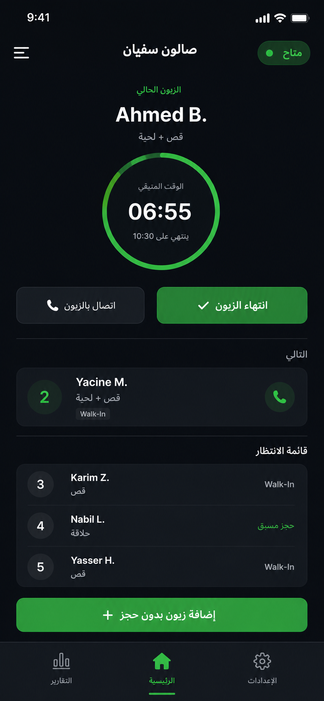
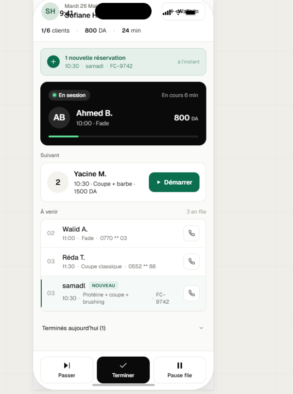

# ✂️ Fade City — Booking & Queue

A mobile-first **barbershop booking and live-queue** prototype, built for an
Algerian barbershop ("salon de coiffure"). It covers the whole loop in one
interactive design: a customer books from their phone, the booking lands
instantly in the barber's app, and the customer can watch their place in the
queue in real time.

Fully **bilingual** — French 🇫🇷 and Arabic 🇩🇿 (with proper right-to-left
layout) — and prices are in Algerian dinar (DA / دج).

> **Status:** UI/UX prototype. State is shared in-memory between the three
> surfaces (no backend, no SMS) — confirming a booking on the customer flow
> propagates straight into the barber's queue via lifted React state.

---

## 🔗 Live demo

Once GitHub Pages is enabled for this repo (see [Deployment](#-deployment)),
the prototype is published automatically at:

**https://msdsmfdslfsddkjfsdjklfsdl.github.io/barber/**

---

## 📸 Screenshots

The barber's mobile app — current client with a live timer, the "next up" card,
the waiting queue, and walk-in / call actions. Shown here in both languages:

| Arabic (RTL) | French — with a live incoming booking |
| :---: | :---: |
|  |  |

In the French shot, the green **"1 nouvelle réservation"** banner and the
**NOUVEAU** tag on _samadl_'s entry are a booking that just arrived from the
customer flow — landing live in the queue.

---

## 🧭 The three surfaces

The app is presented as three phone artboards on a design canvas:

1. **Customer · Web booking flow** — a mobile webview at `barberdz.com/fade-city`.
   Five steps from open to confirmation:
   `Salon landing → Pick barber → Pick time & service → Your details → Confirmed`.

2. **Customer · Live queue tracker** — a single page showing the customer's
   live position. Three states: **3 people before you**, **you're up next**,
   and **session complete**.

3. **Barber · Mobile app** — a glanceable dashboard: the current client, today's
   stats, the live queue, completed history, plus the big workflow actions
   (Start / Finish / Skip / Pause) and a walk-in compose sheet.

---

## ✨ Features

- **Lift-state booking** — a confirmed customer booking appears instantly in the
  barber's queue (idempotent by booking code), no backend round-trip.
- **Live queue tracker** with three customer-facing states.
- **Walk-in compose** — the barber can add a no-booking customer on the fly.
- **Per-row call action** and a collapsible **"Terminés / Completed"** history.
- **Editable barber profiles** — changing a barber's name/specialty/photo in
  Settings reflects on the customer's booking page too.
- **Bilingual FR / AR** with full RTL layout and Arabic typography tuning.
- **Tweaks panel** to flip language, queue position, and booking density
  (sparse vs. busy) live.

### 💈 Service menu

Salon-wide pricing, shown across the booking flow, the confirmation, and the
barber's queue:

| Prestation | الخدمة | Prix | Durée |
| --- | --- | ---: | ---: |
| Coupe adulte | قصة للرجال | 350 DA | 30 min |
| Coupe enfant | قصة طفل | 200 DA | 20 min |
| Barbe | لحية | 100 DA | 10 min |
| Brushing | بروشينغ | 350 DA | 25 min |
| Coupe + barbe | قصة + لحية | 450 DA | 40 min |
| Protéine + coupe + brushing | بروتين + قصة + بروشينغ | 1 500 DA | 75 min |

### 💇 Barbers

| Barber | Specialty |
| --- | --- |
| Karim Belkacem | Fade & dégradé |
| Sofiane Hamidi | Barbe & rasage |
| Yacine Touati | Coupe moderne |
| Mehdi Ouazani | Coupe classique |

---

## 🛠 Tech stack

- **React 18** — loaded from a CDN (no bundler).
- **Babel Standalone** — transpiles the JSX in the browser, so there is **no
  build step**.
- Plain CSS + design tokens (dark "Fade City" theme: slate background, green
  primary).
- Google Fonts: Inter, Cairo, Geist Mono, IBM Plex Sans Arabic.

This keeps the prototype trivially portable — it's just static files.

---

## ▶️ Running locally

Because the JSX files are loaded via `<script src>` and the app uses `fetch()`,
you need to serve the folder over HTTP (opening `index.html` directly with
`file://` will be blocked by the browser).

Any static server works — for example:

```bash
# Python 3 (built-in)
python3 -m http.server 8000

# …or Node
npx serve .
```

Then open <http://localhost:8000>.

---

## 🚀 Deployment

This repo ships a GitHub Actions workflow
([`.github/workflows/deploy-pages.yml`](.github/workflows/deploy-pages.yml))
that publishes the site to **GitHub Pages** on every push to `main` (and to the
current working branch). Because the project is already static, the workflow
just packages the files and deploys them — no build.

**One-time setup:** the workflow uses `actions/configure-pages` with
`enablement: true`, which tries to turn Pages on automatically on the first run.
If your org/repo blocks programmatic enablement, enable it manually once:

> **Settings → Pages → Build and deployment → Source: _GitHub Actions_**

After the workflow's first successful run, the live URL appears in the Actions
run summary (and under the repo's **Environments → github-pages**).

---

## 📁 Project structure

```
.
├── index.html              # Entry point — loads React, Babel, then the JSX files
├── src/
│   ├── data.jsx            # Design tokens, bilingual strings (FR/AR), sample data
│   ├── ui.jsx              # Shared UI primitives (icons, buttons, etc.)
│   ├── customer-flow.jsx   # Customer booking flow (5 steps)
│   ├── queue-tracker.jsx   # Live queue position page (3 states)
│   ├── barber-app.jsx      # Barber's mobile dashboard
│   └── app.jsx             # Composition: 3 artboards + Tweaks panel
├── design-canvas.jsx       # Design-canvas scaffold (sections / artboards)
├── ios-frame.jsx           # iOS device frame wrapper
├── tweaks-panel.jsx        # Live "Tweaks" control panel
├── uploads/                # Screenshots & reference images
└── .github/workflows/      # GitHub Pages deploy workflow
```

> **Note:** `design-canvas.jsx`, `ios-frame.jsx`, and `tweaks-panel.jsx` are the
> presentation scaffold that arranges the three phone artboards side by side and
> exposes the live Tweaks. The actual product UI lives in `src/`.
