# ✂️ Barber 16 — Booking & Queue

A mobile-first **barbershop booking and live-queue** prototype, built for an
Algerian barbershop ("salon de coiffure"). It covers the whole loop in one
interactive design: a customer books from their phone, the booking lands
instantly in the barber's app, and the customer can watch their place in the
queue in real time.

Fully **bilingual** — French 🇫🇷 and Arabic 🇩🇿 (with proper right-to-left
layout) — and prices are in Algerian dinar (DA / دج).

> **Status:** UI/UX prototype, no backend. The all-in-one canvas shares state via
> lifted React state (a confirmed booking lands instantly in the barber's queue)
> and persists to `localStorage`. The customer **site** and the barber **app**
> also ship as two **fully standalone projects** (`site/`, `app/`) — each runnable
> and installable on its own.

---

## 🔗 Live demo

Once GitHub Pages is enabled for this repo (see [Deployment](#-deployment)), it's
published automatically. There are three entry points:

| What | URL |
| --- | --- |
| **All-in-one canvas** (booking + queue + barber app together) | `…github.io/barber/` |
| **Booking site** (customers) | `…github.io/barber/site/` |
| **Barber app** (installable PWA) | `…github.io/barber/app/` |

> Base: `https://msdsmfdslfsddkjfsdjklfsdl.github.io`

---

## 📸 Screenshots

Every shot below is captured from the running project — the customer **site**
(web booking + live queue) and the barber **app**.

### Customer site — booking

| 1 · Salon landing | 2 · Choose your barber | 3 · Services + add-ons |
| :---: | :---: | :---: |
| 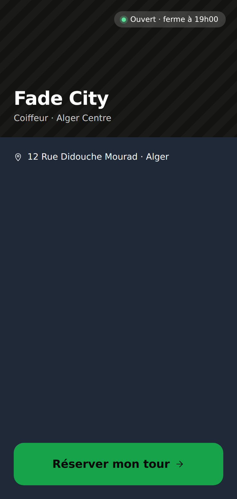 | 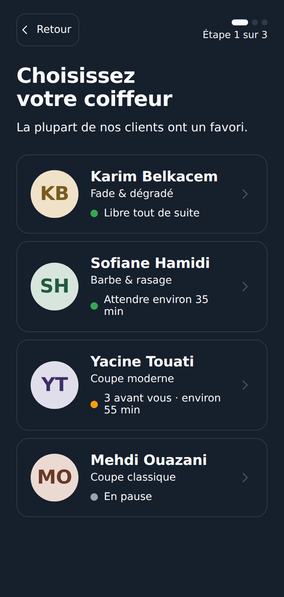 | 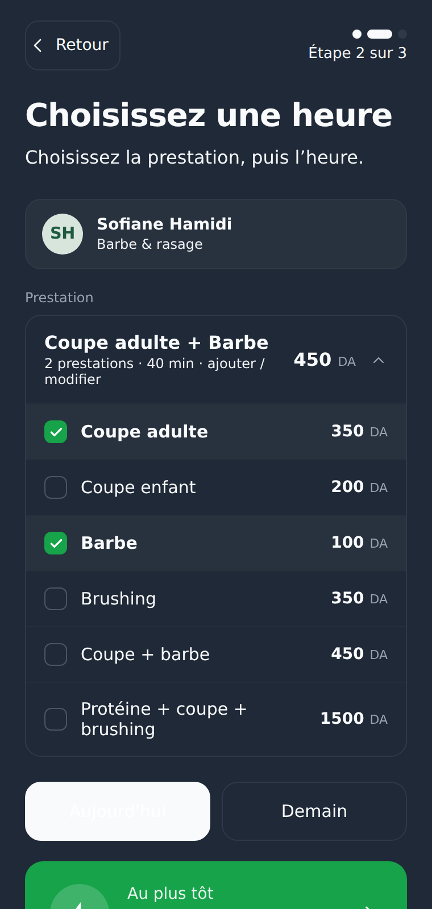 |

| 4 · Your details | 5 · Confirmed |
| :---: | :---: |
| 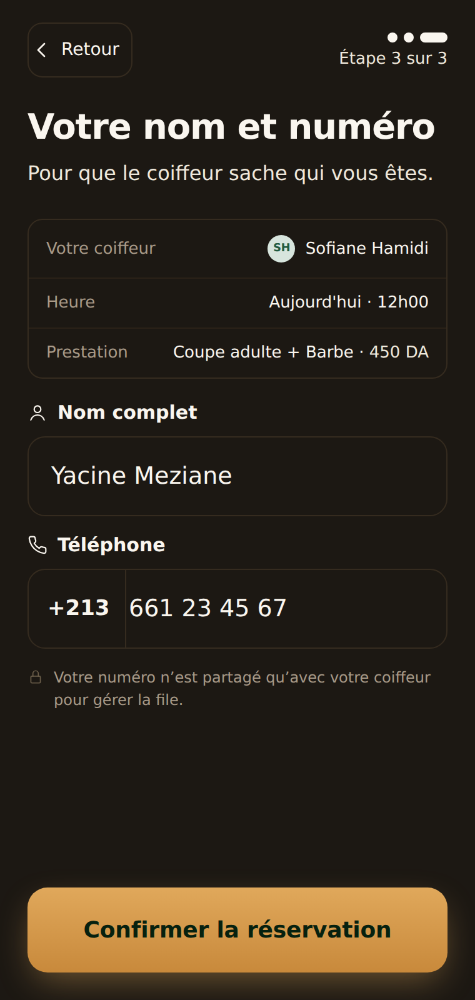 | 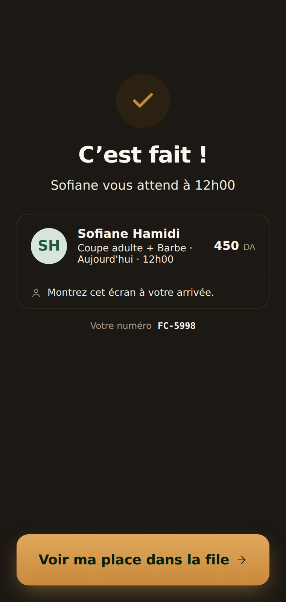 |

Services stack into one booking — *Coupe adulte + Barbe* totals **450 DA** and
carries through the summary, the confirmation, and the barber's queue.

### Customer site — live queue tracker

| Waiting in line | You're next (live) | Session complete |
| :---: | :---: | :---: |
| 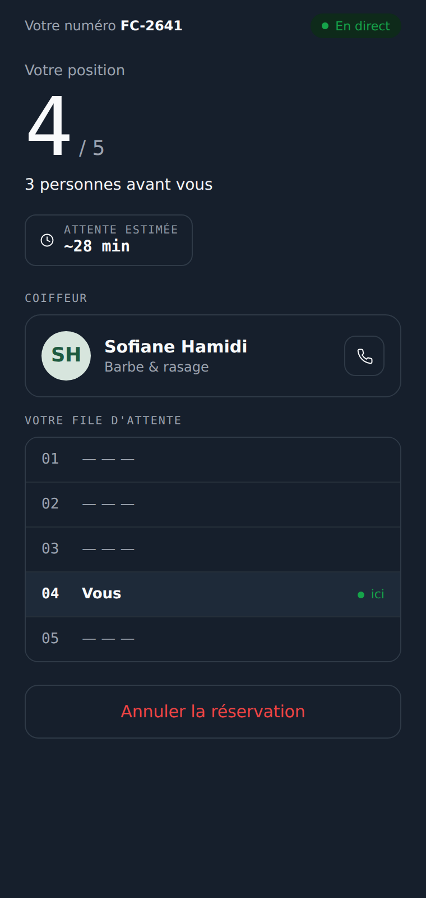 | 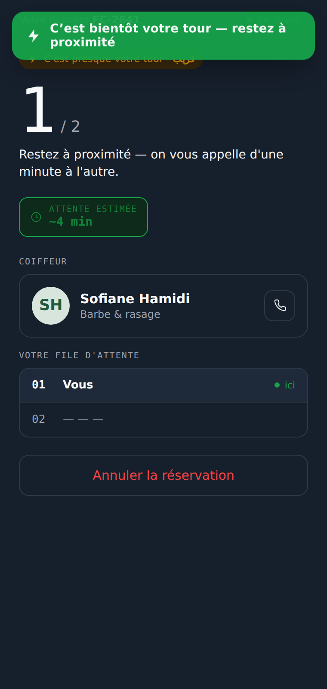 |  |

The position moves up on its own and fires a **"C'est bientôt votre tour"**
notification the moment you reach the front.

### Barber app — day timeline

Redesigned as a **day timeline (agenda)** in a clean **minimal-flat** style: the
day runs top-to-bottom with appointment times and a connected spine. Done slots
are dimmed; the active **"En chaise"** slot is highlighted with a live timer;
upcoming slots start in one tap.

| Day timeline | Cash checkout | Add a walk-in | Arabic (RTL) |
| :---: | :---: | :---: | :---: |
| 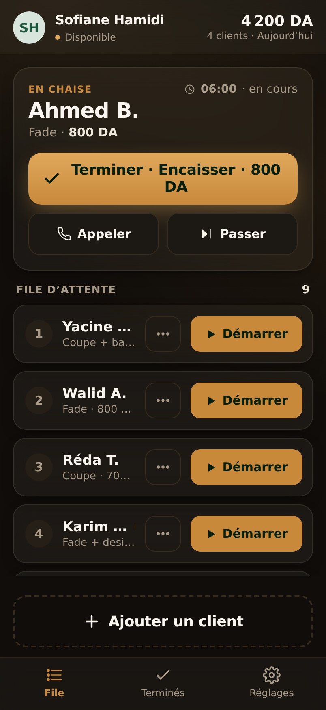 | 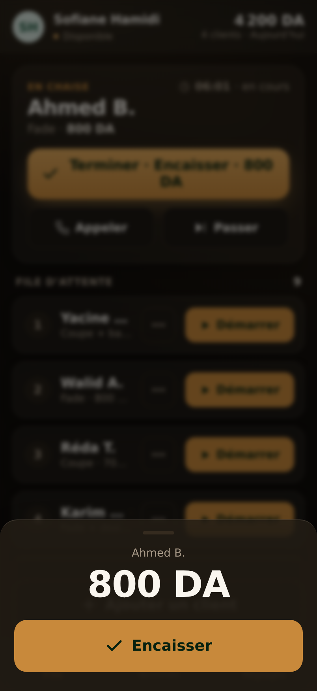 | 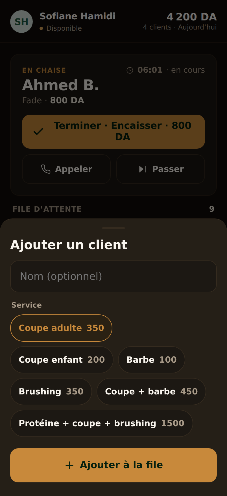 | 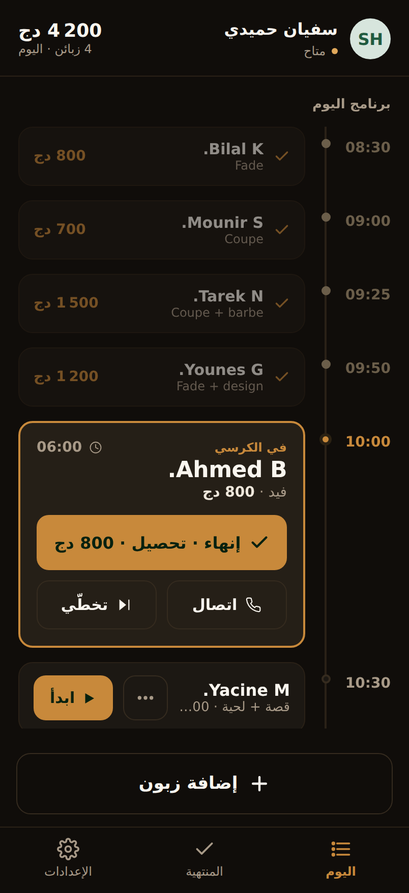 |

**Terminer · Encaisser** finishes and charges in two taps (cash); any upcoming
client starts with one tap; and the tappable **Disponible / Indisponible** pill
pauses or resumes accepting new clients.

---

## 🧭 The three surfaces

The app is presented as three phone artboards on a design canvas:

1. **Customer · Web booking flow** — a mobile webview at `barberdz.com/barber-16`.
   Five steps from open to confirmation:
   `Salon landing → Pick barber → Pick time + services → Your details → Confirmed`.

2. **Customer · Live queue tracker** — a single page showing the customer's
   position, which **advances on its own** and notifies them when they're next.
   Three states: **people ahead of you**, **you're up next**, and **session complete**.

3. **Barber · Mobile app (day timeline)** — the day as a vertical agenda: done
   slots dimmed, the active "En chaise" slot highlighted (live timer + one-tap
   **finish & charge**), upcoming slots start in one tap. Plus walk-ins, today's
   takings, and a **Disponible / Indisponible** toggle to pause new clients.

---

## ✨ Features

- **Day-timeline barber dashboard** — the barber's day as a vertical agenda
  (done · in-chair · upcoming) with big one-tap actions.
- **Availability toggle** — a tappable *Disponible / Indisponible* pill that
  pauses or resumes accepting new clients (banner + disabled "add" when off).
- **Service add-ons** — stack multiple prestations (*Coupe + Barbe + Brushing*)
  with a live total in DA, carried through to the barber's queue.
- **Living queue tracker** — the customer's position moves up over time, the ETA
  recomputes, and a *"C'est votre tour · حان دورك"* notification fires when next.
- **Lift-state booking** — in the canvas, a confirmed booking appears instantly
  in the barber's queue (idempotent by code), no backend round-trip.
- **Cash checkout** — finish & charge in two taps.
- **Walk-ins & returning customers** — add a walk-in on the fly; the booking form
  remembers name/phone for next time.
- **Installable PWA** — add-to-home-screen, app icon, offline app shell, and a
  branded loading splash.
- **Persists to `localStorage`** — bookings and profile edits survive a refresh.
- **Charcoal + Brass, minimal-flat design** — warm theme, clean flat surfaces.
- **Bilingual FR / AR** with full RTL layout and Arabic typography tuning.
- **Accessible** — visible focus rings, ≥44px touch targets, reduced-motion support.
- **Tweaks panel** (canvas) to flip language, queue state, and density live.

### 💈 Service menu

Salon-wide pricing, shown across the booking flow, the confirmation, and the
barber's queue:

| Prestation | الخدمة | Prix | Durée |
| --- | --- | ---: | ---: |
| Coupe adulte | قصة للرجال | 350 DA | 30 min |
| Coupe enfant | قصة طفل | 200 DA | 20 min |
| Barbe | لحية | 100 DA | 10 min |
| Brushing | بروشينغ | 350 DA | 25 min |
| Coupe + barbe | قصة + لحية | 450 DA | 40 min |
| Protéine + coupe + brushing | بروتين + قصة + بروشينغ | 1 500 DA | 75 min |

### 💇 Barbers

| Barber | Specialty |
| --- | --- |
| Karim Belkacem | Fade & dégradé |
| Sofiane Hamidi | Barbe & rasage |
| Yacine Touati | Coupe moderne |
| Mehdi Ouazani | Coupe classique |

---

## 🛠 Tech stack

- **React 18** — vendored locally in `vendor/` (no bundler, no CDN dependency).
- **Babel Standalone** — transpiles the JSX in the browser, so there is **no
  build step**.
- Plain CSS + semantic design tokens — **Charcoal + Brass** theme (warm charcoal
  background, brass/gold accent) in a minimal-flat style.
- Google Fonts: Inter, Cairo, Geist Mono, IBM Plex Sans Arabic.
- **PWA** — a web manifest + service worker make it installable and offline-capable.
- **localStorage** — persists bookings and barber profile edits (no backend).

This keeps the prototype trivially portable — it's just static files.

---

## ▶️ Running locally

Because the JSX files are loaded via `<script src>` and the app uses `fetch()`,
you need to serve the folder over HTTP (opening `index.html` directly with
`file://` will be blocked by the browser).

Any static server works — for example:

```bash
# Python 3 (built-in)
python3 -m http.server 8000

# …or Node
npx serve .
```

Then open <http://localhost:8000>. The standalone **`site/`** and **`app/`**
folders run the same way — `cd` into either and serve it on its own.

---

## 🚀 Deployment

This repo ships a GitHub Actions workflow
([`.github/workflows/deploy-pages.yml`](.github/workflows/deploy-pages.yml))
that publishes the site to **GitHub Pages** on every push to `main` (and to the
current working branch). Because the project is already static, the workflow
just packages the files and deploys them — no build.

**One-time setup:** the workflow uses `actions/configure-pages` with
`enablement: true`, which tries to turn Pages on automatically on the first run.
If your org/repo blocks programmatic enablement, enable it manually once:

> **Settings → Pages → Build and deployment → Source: _GitHub Actions_**

After the workflow's first successful run, the live URL appears in the Actions
run summary (and under the repo's **Environments → github-pages**).

---

## 📁 Project structure

```
.
├── index.html              # All-in-one canvas (booking + queue + barber app)
├── manifest.webmanifest    # PWA manifest          ├── sw.js  (offline service worker)
├── icon-192.png · icon-512.png   # PWA icons (brass)
├── vendor/                 # React + Babel (vendored — no CDN at runtime)
├── src/
│   ├── data.jsx            # Design tokens (Charcoal+Brass) · FR/AR strings · data
│   ├── ui.jsx              # Shared UI primitives (icons, avatar, button…)
│   ├── customer-flow.jsx   # Customer booking flow (5 steps)
│   ├── queue-tracker.jsx   # Live, auto-advancing queue page
│   ├── barber-fast.jsx     # Barber app — day-timeline dashboard (current design)
│   ├── barber-app.jsx      # Original barber dashboard (kept for reference)
│   └── app.jsx             # Canvas composition + Tweaks panel
├── design-canvas.jsx · ios-frame.jsx · tweaks-panel.jsx   # canvas scaffold
│
├── site/                   # ▶ Standalone booking SITE (own index/manifest/sw/icons)
│   └── src/                #   data · ui · customer-flow · queue-tracker
├── app/                    # ▶ Standalone barber APP — installable PWA
│   └── src/                #   data · ui · helpers · barber-fast
│
├── screenshots/            # README screenshots
└── .github/workflows/      # GitHub Pages deploy workflow
```

> **Note:** the repo root + `src/` is the all-in-one **canvas** (three phone
> artboards + Tweaks). `site/` and `app/` are **self-contained** copies — each
> bundles its own React/Babel, manifest, service worker and icons, so either can
> be moved into its own repo and run as-is. The live "booking → barber" link only
> works in the canvas (shared state); the split apps would need a backend to sync.
