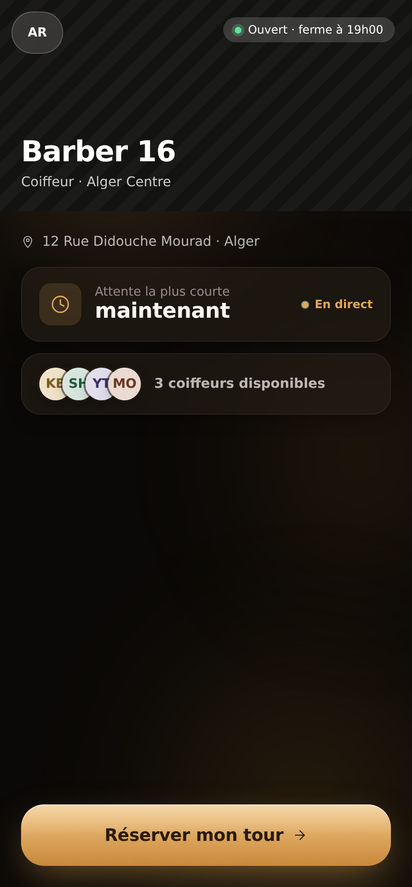
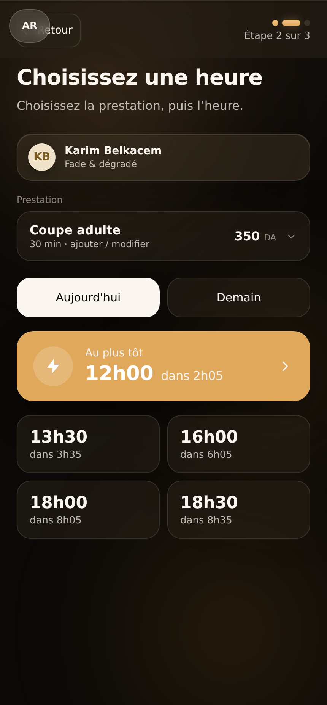
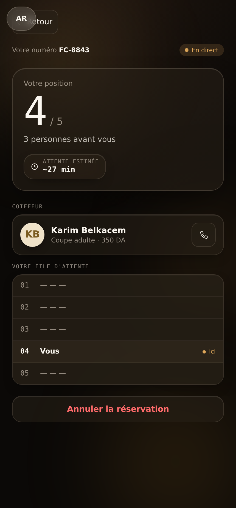
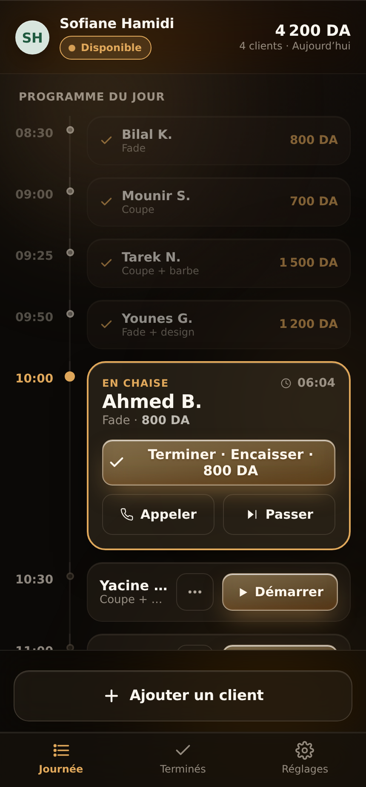

# ✂️ Barber 16 — Booking & Queue

A small, mobile-first prototype for an Algerian barbershop. A customer books from
their phone, the booking shows up in the barber's app, and the customer can watch
their place move up in the **live queue**.

- Fully bilingual — **French 🇫🇷 / Arabic 🇩🇿** (with right-to-left layout)
- Prices in Algerian dinar (DA)
- Designed in an **iOS-26 “Liquid Glass”** style — translucent glass + soft motion

> ℹ️ It's a **front-end prototype**: no backend, no database. The data is sample
> data, and anything you change is saved in your browser (`localStorage`).

---

## 📦 What's inside

The project is **three things in one**, all plain static files:

| Folder | What it is | Opens at |
| --- | --- | --- |
| `/` (root) | **Design canvas** — all three screens side by side | `/` |
| `site/` | **Customer booking site** — book a slot + live queue | `/site/` |
| `app/` | **Barber app** — the day dashboard (installable) | `/app/` |

---

## 📸 Screenshots

| Booking | Pick a time | Live queue | Barber app |
| :---: | :---: | :---: | :---: |
|  |  |  |  |

---

## ▶️ Run it on your computer

You **don't need to install anything or run a build** — it's just HTML and
JavaScript files. But you can't open `index.html` by double-clicking it: the app
loads its files in a way browsers block on `file://`. So you start a tiny local
web server. Pick whichever is easiest for you:

**Option 1 — Python** (already installed on most Macs/Linux):

```bash
python3 -m http.server 8000
```

Then open **http://localhost:8000** in your browser.

**Option 2 — Node.js** (works on Windows/Mac/Linux):

```bash
npx serve
```

It prints a local address (usually `http://localhost:3000`) — open it.

**Option 3 — VS Code** (easiest if you already use it):
install the **Live Server** extension, then right-click `index.html` →
**“Open with Live Server.”**

Once it's running, try the three pages:

- `http://localhost:8000/` — the design canvas (all three screens)
- `http://localhost:8000/site/` — the customer booking site
- `http://localhost:8000/app/` — the barber app

> 💡 No `npm install`, no build step. React and Babel are already bundled in
> `vendor/`, and the JSX is compiled right in the browser.

---

## 🚀 Put it online (deploy)

Because it's just static files, it hosts **anywhere for free**. Here are three
easy ways, from easiest to most automatic.

### Vercel (recommended)

1. Push this project to GitHub (it already is).
2. Go to **[vercel.com](https://vercel.com)**, sign in with GitHub, click
   **Add New → Project**, and import this repository.
3. Use these settings (it's a plain static site):
   - **Framework Preset:** `Other`
   - **Build Command:** *leave empty*
   - **Output Directory:** *leave empty*
4. Click **Deploy**. After a few seconds you get a link like
   `your-project.vercel.app`:
   - Booking site → `your-project.vercel.app/site/`
   - Barber app → `your-project.vercel.app/app/`

**Want the booking site to be the home page** (open at the root URL instead of
`/site/`)? In your Vercel project: **Settings → General → Root Directory**, set it
to `site`, and redeploy. (Use `app` to make the barber app the home page.)

Prefer the terminal? From the project folder:

```bash
npm i -g vercel
vercel
```

### Netlify

Even simpler: go to **[app.netlify.com](https://app.netlify.com)** and
**drag-and-drop** the project folder (or just the `site/` folder) onto the page.
No build command needed.

### GitHub Pages

This repo already includes a workflow (`.github/workflows/deploy-pages.yml`) that
publishes on every push. Turn it on once:
**Settings → Pages → Build and deployment → Source: GitHub Actions.**
Your pages then live at `https://<your-username>.github.io/<repo>/`
(site at `/site/`, app at `/app/`).

---

## 🧩 How it's built (short version)

- **React 18 + Babel** are bundled in `vendor/` — no bundler, no CDN, **no build
  step**. Babel turns the JSX into JavaScript right in the browser.
- Plain CSS with shared **design tokens** for the iOS-26 liquid-glass look.
- **PWA**: each app has a web manifest + service worker, so it can be installed to
  the home screen and works offline.
- Saves to **`localStorage`** (no server).

---

## 📁 Project structure

```
.
├── index.html            # Design canvas — all three screens together
├── sw.js · manifest.webmanifest · icon-*.png   # PWA bits
├── vendor/               # React + Babel (bundled in — no CDN)
├── src/                  # Shared source code
│   ├── data.jsx          # Design tokens · FR/AR text · sample data
│   ├── ui.jsx            # Shared UI (buttons, icons, glass…)
│   ├── customer-flow.jsx # The booking flow
│   ├── queue-tracker.jsx # The live queue page
│   ├── barber-fast.jsx   # The barber app
│   └── app.jsx           # Canvas layout
├── site/                 # ▶ Standalone customer booking site
└── app/                  # ▶ Standalone barber app
```

> The standalone `site/` and `app/` folders each bundle their own copy of
> everything (React, Babel, manifest, service worker, icons), so either one can be
> deployed on its own.

---

Made for a barbershop in Algiers. Clone it, serve it, and you're running. 🚀
